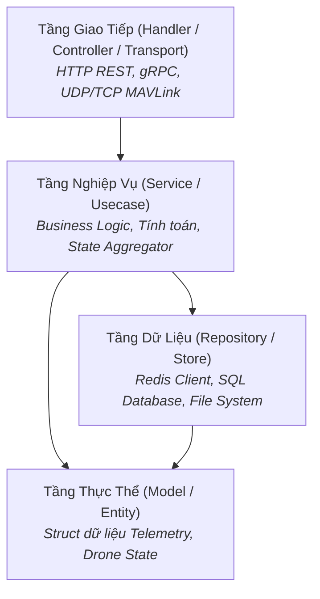

# 📐 HƯỚNG DẪN CẤU TRÚC THƯ MỤC CHUẨN TRONG DỰ ÁN GOLANG
> **Tài liệu tham khảo & Quy chuẩn thiết kế kiến trúc mã nguồn Go (Standard Go Project Layout & Clean Architecture)**

---

## 📑 MỤC LỤC
1. [Triết lý cấu trúc trong Golang](#1-triết-lý-cấu-trúc-trong-golang)
2. [Sơ đồ cây thư mục chuẩn (Standard Layout Tree)](#2-sơ-đồ-cây-thư-mục-chuẩn-standard-layout-tree)
3. [Chi tiết vai trò & tác dụng của từng thư mục](#3-chi-tiết-vai-trò--tác-dụng-của-từng-thư-mục)
4. [Mô hình Clean Architecture bên trong `/internal`](#4-mô-hình-clean-architecture-bên-trong-internal)
5. [Đối chiếu thực tế với dự án `telemetry-ingestion-service`](#5-đối-chiếu-thực-tế-với-dự-án-telemetry-ingestion-service)
6. [Các nguyên tắc vàng (Best Practices) khi code Go](#6-các-nguyên-tắc-vàng-best-practices-khi-code-go)

---

## 1. Triết lý cấu trúc trong Golang

Khác với các framework như Spring Boot (Java), NestJS (TypeScript) hay Ruby on Rails, ngôn ngữ Go **không áp đặt sẵn** một bộ khung thư mục cố định. Tuy nhiên, để đảm bảo tính module hóa, bảo mật phạm vi code và dễ mở rộng, cộng đồng lập trình viên Go toàn cầu đã thống nhất chuẩn **Standard Go Project Layout** (`golang-standards/project-layout`).

### 3 Quy tắc nền tảng:
- **Ngắn gọn & Tường minh (Keep it simple & explicit):** Tên thư mục/package phải thể hiện đúng một chức năng duy nhất.
- **Bảo vệ phạm vi truy cập (Enforced Privacy):** Tận dụng tính năng của Go compiler đối với thư mục `internal/` để ngăn chặn import trái phép từ ngoài module.
- **Không phụ thuộc vòng (No Circular Dependencies):** Luồng phụ thuộc giữa các package luôn đi theo 1 chiều: `cmd -> handler -> service -> repository -> model`.

---

## 2. Sơ đồ cây thư mục chuẩn (Standard Layout Tree)

```text
my-go-project/
├── cmd/                        # Điểm khởi chạy ứng dụng (Entry Points)
│   ├── server/
│   │   └── main.go             # File main chạy Server chính
│   └── cli-tool/
│       └── main.go             # File main chạy công cụ dòng lệnh (nếu có)
├── internal/                   # Code nghiệp vụ nội bộ (PRIVATE - Go Compiler bảo vệ)
│   ├── config/                 # Đọc và ánh xạ biến môi trường (.env, yaml)
│   ├── handler/                # Tầng tiếp nhận request (HTTP REST / gRPC / Webhook)
│   ├── service/                # Tầng nghiệp vụ cốt lõi (Business Logic / Usecases)
│   ├── repository/             # Tầng tương tác Cơ sở dữ liệu / Cache (Database / Redis)
│   └── model/                  # Khai báo Struct / Entity nghiệp vụ
├── pkg/                        # Code thư viện dùng chung (PUBLIC - Cho phép module khác import)
│   ├── logger/                 # Bộ ghi log dùng chung
│   └── utils/                  # Hàm tiện ích thuần túy (crypto, string, date...)
├── api/                        # Đặc tả giao diện & Protocol Specs (Protobuf, OpenAPI, Swagger)
│   ├── proto/
│   └── openapi/
├── configs/                    # File cấu hình mẫu, file cấu hình tĩnh (config.yaml, .env.example)
├── deployments/                # Cấu hình đóng gói & triển khai (Dockerfile, Docker Compose, K8s)
├── scripts/                    # Scripts tự động hóa (Build, Migrate DB, CI/CD)
├── test/                       # Bài kiểm thử cấp cao (Integration Test, E2E Test, Test Data)
├── web/                        # Giao diện tĩnh Frontend / HTML Templates (nếu có SSR)
├── go.mod                      # Khai báo module name và danh sách dependencies
├── go.sum                      # Checksum bảo vệ tính toàn vẹn của thư viện bên thứ 3
├── Makefile                    # Phím tắt lệnh tự động (make run, make build, make test)
└── README.md                   # Tài liệu giới thiệu và hướng dẫn chạy dự án
```

---

## 3. Chi tiết vai trò & tác dụng của từng thư mục

### 🔹 `/cmd` (Commands / Entrypoints)
* **Mục đích:** Chứa các file `main.go` — điểm kích hoạt thực thi của chương trình.
* **Quy tắc:**
  * Mỗi thư mục con đại diện cho một binary thực thi riêng biệt (ví dụ: `cmd/server/main.go`, `cmd/simulator/main.go`, `cmd/migrate/main.go`).
  * **Code tại đây phải cực kỳ ngắn gọn:** Chỉ làm nhiệm vụ đọc config, khởi tạo dependencies (Dependency Injection) và gọi hàm Run/Start từ `/internal`. Tuyệt đối không viết business logic tại `/cmd`.

---

### 🔹 `/internal` (Private Application Code)
* **Mục đích:** Chứa toàn bộ mã nguồn nghiệp vụ chính của ứng dụng.
* **Cơ chế đặc biệt của Go:**
  > [!IMPORTANT]
  > Trình biên dịch của Go **ngăn cấm hoàn toàn (Compiler-Enforced)** việc bất kỳ project/module bên ngoài nào `import` code nằm trong thư mục `/internal`. Điều này bảo vệ kiến trúc dự án không bị phụ thuộc ngoài ý muốn.

---

### 🔹 `/pkg` (Public Shared Libraries)
* **Mục đích:** Chứa các hàm/thư viện mà bạn **cố ý cho phép** các dự án khác hoặc module bên ngoài có thể import và tái sử dụng.
* **Ví dụ:** `github.com/your-name/project/pkg/models` hoặc `pkg/logger`.
* *Lưu ý:* Nếu một package chỉ phục vụ nội bộ dự án này, hãy đặt vào `/internal` thay vì `/pkg`.

---

### 🔹 `/api`
* **Mục đích:** Lưu trữ các định nghĩa giao thức giao tiếp:
  * File Protocol Buffers (`.proto`) cho gRPC.
  * File OpenAPI / Swagger (`.yaml`, `.json`).
  * JSON Schema định nghĩa cấu trúc gói tin.

---

### 🔹 `/configs` hoặc `/config`
* **Mục đích:** Chứa các template cấu hình mẫu, file cấu hình tĩnh theo môi trường:
  * `config.dev.yaml`, `config.prod.yaml`
  * `.env.example`

---

### 🔹 `/deployments` hoặc `/build`
* **Mục đích:** Chứa tài nguyên triển khai hệ thống:
  * `Dockerfile` (Multi-stage build).
  * `docker-compose.yml`.
  * Kubernetes manifests (`deployment.yaml`, `service.yaml`, Helm Charts).

---

### 🔹 `/scripts`
* **Mục đích:** Chứa các file shell script (`.sh`), PowerShell (`.ps1`) hỗ trợ phát triển:
  * Script chạy Migration Database.
  * Script sinh code tự động (`protoc`, `mockgen`).
  * Script kiểm tra linting và formatting code.

---

### 🔹 `/test`
* **Mục đích:** Chứa các bài kiểm thử quy mô lớn:
  * **Integration Tests:** Kiểm thử tích hợp giữa Go code với Database / Redis thật.
  * **E2E Tests:** Kiểm thử toàn bộ luồng từ lúc nhận request đến khi trả kết quả.
  * *Lưu ý:* Unit test thông thường trong Go sẽ được viết **ngay bên cạnh file code** (ví dụ: `resolver.go` đi cùng `resolver_test.go`), không gom vào thư mục `/test`.

---

## 4. Mô hình Clean Architecture bên trong `/internal`

Bên trong `/internal`, các package thường được phân lớp rõ ràng theo nguyên lý luồng phụ thuộc 1 chiều:



| Tầng | Thư mục | Nhiệm vụ |
|---|---|---|
| **Transport / Handler** | `internal/handler` hoặc `internal/mavlink` | Nhận request từ ngoài vào, kiểm tra tính hợp lệ (validate), giải mã gói tin. |
| **Business Logic** | `internal/service` hoặc `internal/state` | Xử lý logic tính toán, tổng hợp trạng thái, kiểm tra timeout. |
| **Storage / Broker** | `internal/repository` hoặc `internal/publisher` | Lưu trữ dữ liệu vào Database, nạp Cache, bắn tin qua Redis Pub/Sub. |
| **Domain Models** | `internal/model` hoặc `pkg/models` | Định nghĩa các Struct dữ liệu cơ bản. |

---

## 5. Đối chiếu thực tế với dự án `telemetry-ingestion-service`

Dự án Ingestion Service của bạn áp dụng rất chuẩn mực cấu trúc này:

```text
telemetry-ingestion-service/
├── cmd/
│   ├── server/
│   │   └── main.go       # Khởi tạo gomavlib UDP/TCP, Redis, lắng nghe sự kiện
│   └── simulator/
│       └── main.go       # Bộ giả lập phi đội Drone bay ảo
├── internal/
│   ├── config/           # Đọc UDP_LISTEN_ADDR, REDIS_ADDR từ môi trường
│   ├── mavlink/          # Giải mã gói tin MAVLink (Heartbeat, GPS, Attitude, VFR_HUD)
│   ├── publisher/        # Đẩy dữ liệu Telemetry vào Redis Pub/Sub & Hash
│   ├── resolver/         # Ánh xạ IP VPN 10.13.37.X và SystemID sang DeviceID
│   └── state/            # Quản lý bộ nhớ RAM trạng thái Drone và kiểm tra Timeout (Offline)
├── pkg/
│   └── models/           # Khai báo Struct TelemetryPayload, BatteryInfo, GpsInfo
├── Dockerfile            # Multi-stage Dockerfile tối ưu dung lượng binary
├── go.mod & go.sum       # Module dependencies (gomavlib, go-redis, godotenv)
└── README.md
```

---

## 6. Các nguyên tắc vàng (Best Practices) khi code Go

1. **Tránh lỗi Import vòng tròn (Circular Dependency):**
   * Go **không cho phép** Package A import Package B trong khi Package B lại import Package A.
   * *Giải pháp:* Tách các struct/interface dùng chung ra một package tầng dưới (ví dụ `pkg/models`).

2. **Accept Interfaces, Return Structs:**
   * Trong tham số hàm: Nhận vào là một `interface` (để dễ mock khi viết unit test).
   * Giá trị trả về của hàm khởi tạo (`New...`): Trả về con trỏ tới struct cụ thể (`*StateAggregator`, `*RedisPublisher`).

3. **Xử lý lỗi tường minh (Explicit Error Handling):**
   * Không bao giờ lờ đi lỗi (`_ = err`). Luôn kiểm tra `if err != nil` và bọc lỗi bằng `fmt.Errorf("mô tả lỗi: %w", err)`.

4. **Tên Package ngắn gọn, rõ nghĩa:**
   * Tên package viết thường toàn bộ, không dùng dấu gạch dưới (`_`) hay CamelCase (ví dụ: `ipresolver` thay vì `ip_resolver` hoặc `ipResolver`).
